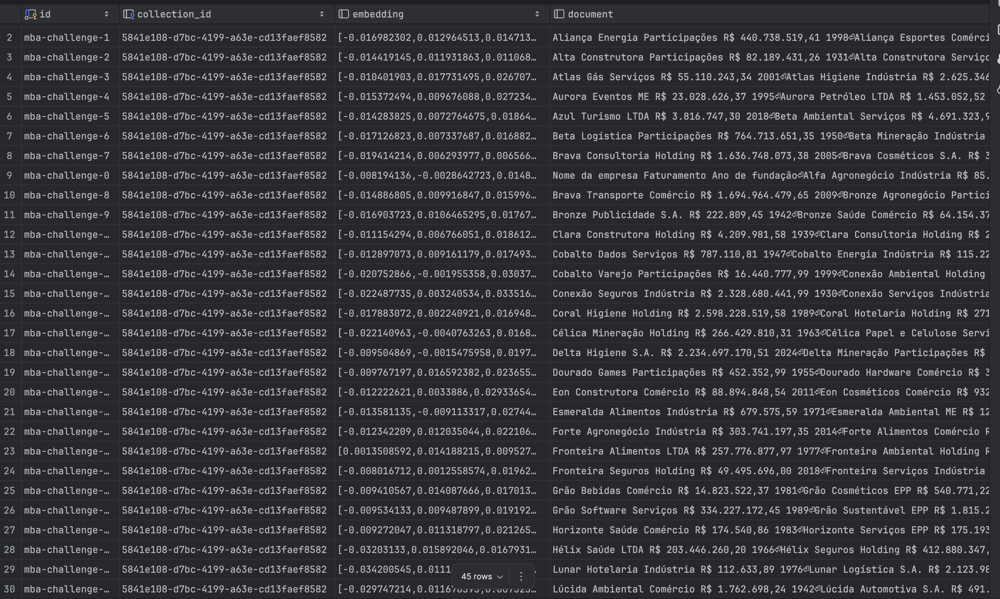
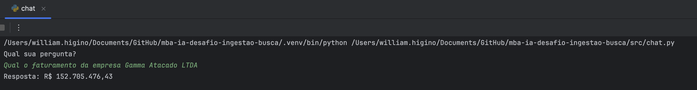
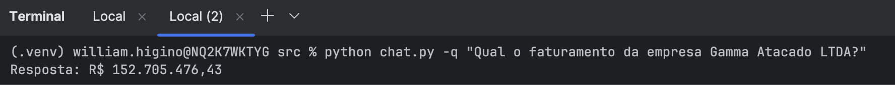

# Desafio MBA Engenharia de Software com IA - Full Cycle

- Utilizei gemini para embedding e para a LLM, portanto as variáveis de ambiente verificadas são `GOOGLE_EMBEDDING_MODEL` e `GOOGLE_API_KEY`. 

A execução do script `ingest.py` deve inserir os dados do arquivo especificado pella variavél `PDF_PATH` no banco de dados através do PGVector.

Uma vez que o PDF tenha tido os dados embedded e ingeridos, é possível executar o script `chat.py` para efetuar buscas com informações do banco utilizando `similarity_search_with_score`.
Há 2 formas de consultar informações:

### 1 - Executar o script `chat.py` sem nenhum parâmetro.
Isso fará com que o script entre em um modo interativo, onde o usuário pode digitar perguntas e receber respostas baseadas no conteúdo ingerido do PDF.

### 2 - Executar o script `chat.py` com o parâmetro `-q "sua pergunta aqui"`.
Isso fará com que o script responda diretamente à pergunta fornecida como argumento.
